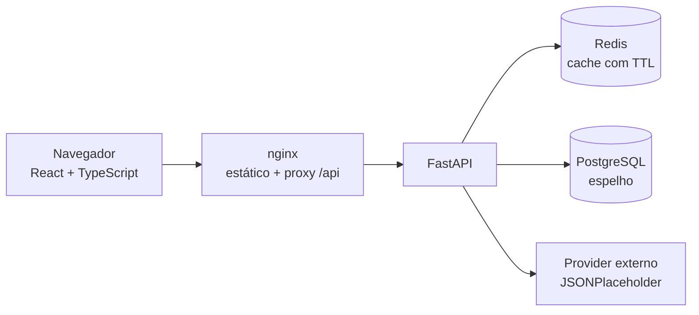
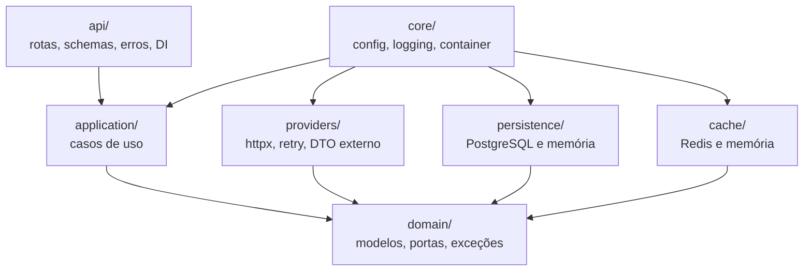
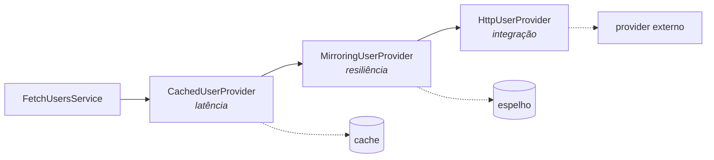
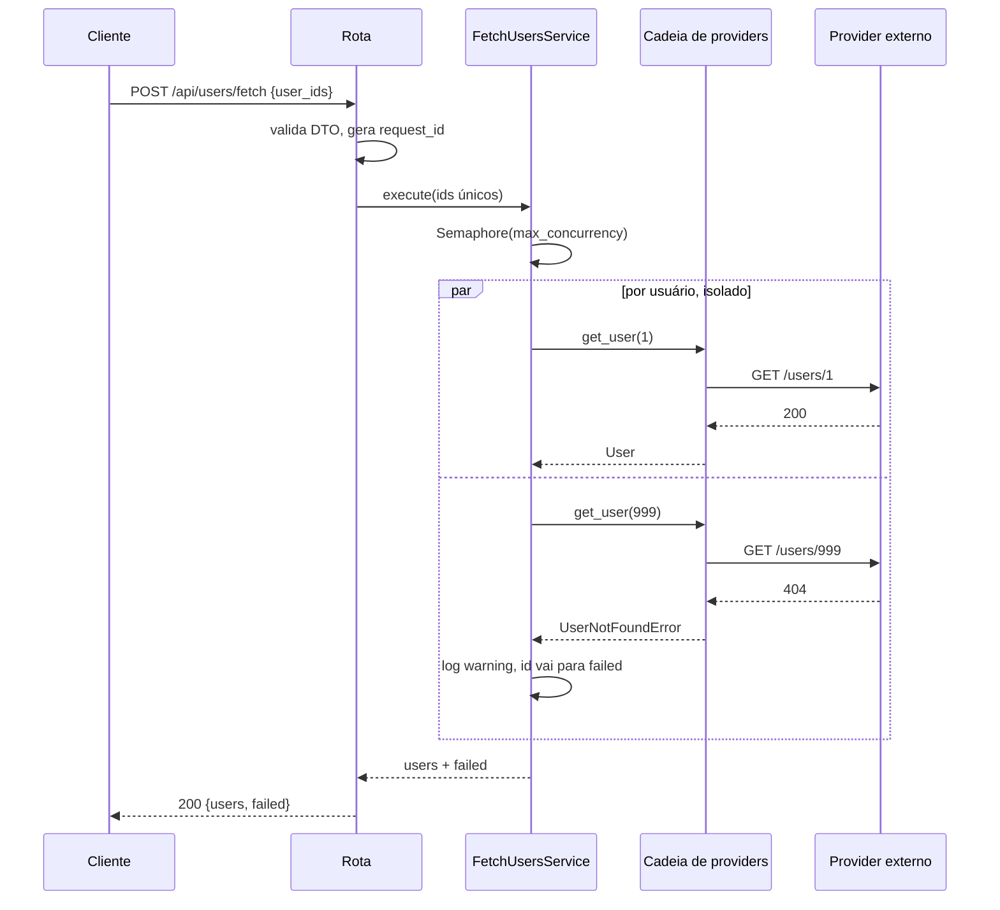
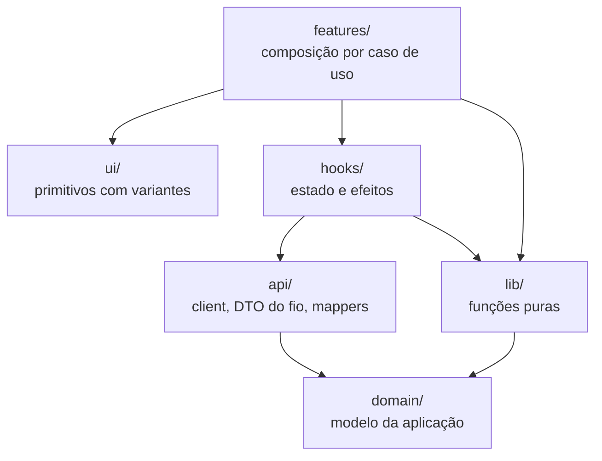

# Consulta de usuários

Aplicação full stack que consulta múltiplos usuários em um provider HTTP externo de forma
assíncrona, isolando falhas: um usuário que falha não interrompe os demais.

- **Backend**: Python 3.10+ · FastAPI · httpx · Pydantic v2 · SQLAlchemy 2 (async) · uv
- **Frontend**: React 18 · TypeScript · Vite · CSS puro (mobile-first)
- **Infra**: Docker Compose (API, web, PostgreSQL, Redis) · GitHub Actions · Husky

## Como executar

### Docker

```bash
docker compose up -d
```

- Web: http://localhost:8080
- API: http://localhost:8000
- Swagger UI: http://localhost:8000/docs · **ReDoc**: http://localhost:8000/redoc

Sobe API, frontend, PostgreSQL e Redis. A API espera os bancos ficarem saudáveis antes de
iniciar e cria o schema sozinha.

### Local

Backend (requer [uv](https://docs.astral.sh/uv/); `pip install uv` resolve):

```bash
cd backend
uv sync
uv run uvicorn app.main:app --reload
```

Frontend:

```bash
cd frontend
npm install
npm run dev          # http://localhost:5173, com proxy de /api para :8000
```

Sem `APP_DATABASE_URL` e `APP_REDIS_URL` a aplicação sobe com espelho e cache em memória — não é
preciso PostgreSQL nem Redis para rodar local. Veja `backend/.env.example`.

### Qualidade

```bash
npm install          # instala os hooks de git (husky)
npm run verify       # lint, tipagem e testes dos dois apps
```

Ou individualmente:

```bash
cd backend  && uv run ruff check . && uv run mypy && uv run pytest
cd frontend && npm run typecheck && npm test
```

## Endpoints

### `POST /api/users/fetch`

```bash
curl -X POST http://localhost:8000/api/users/fetch \
  -H 'Content-Type: application/json' \
  -d '{"user_ids": [1, 2, 3, 999]}'
```

```json
{
  "users": [{ "id": 1, "name": "Leanne Graham", "username": "Bret", "email": "...", "phone": "17707368031" }],
  "failed": [999]
}
```

### `GET /api/users`

Lista o espelho local dos usuários já resolvidos. **Busca, ordenação e paginação são resolvidas
no servidor** — o cliente nunca recebe a coleção inteira. A busca cobre qualquer campo: ID, nome,
usuário, e-mail e telefone (por dígitos, ignorando máscara).

```bash
curl 'http://localhost:8000/api/users?search=ana&sort_by=name&sort_direction=desc&page=2&page_size=10'
```

```json
{ "items": [], "page": 2, "page_size": 10, "total": 0, "total_pages": 0 }
```

### Erros

Todas as respostas de erro usam o mesmo envelope:

```json
{
  "error": {
    "code": "validation_error",
    "message": "Confira os IDs informados: são aceitos apenas números inteiros positivos.",
    "details": ["body.user_ids: List should have at least 1 item"],
    "request_id": "7f3c1e9a4b2d4f8a9c0e1b2d3f4a5b6c"
  }
}
```

## Arquitetura

### Visão geral



### Camadas do backend

Dependências apontam sempre para dentro: `domain` não conhece ninguém.



### Cadeia de decorators

Cada elo implementa a mesma porta `UserProvider` e é composto em `core/container.py`.



- `CachedUserProvider`: evita ida ao provider para usuário já resolvido (Redis ou memória, TTL).
- `MirroringUserProvider`: grava todo usuário resolvido no espelho e serve o espelho quando o
  provider está indisponível. Usuário inexistente (404) não é degradável e propaga direto.
- `HttpUserProvider`: retry com backoff exponencial e jitter para 429/5xx/timeout, respeitando
  `Retry-After`. Nunca faz retry de 404.

### Fluxo de uma consulta em lote



### Estrutura do frontend



**Ports & Adapters.** O caso de uso depende do `Protocol` `UserProvider`, nunca de `httpx`.
Trocar o provider externo por gRPC, banco ou mock é criar outro adapter e mudar uma linha no
composition root.

## Decisões técnicas

**Isolamento de falha.** Cada ID vira uma corrotina independente; a exceção é capturada dentro
dela e vira `None`, que o serviço converte em ID na lista `failed`. `asyncio.gather` nunca recebe
uma exceção que cancelaria as demais.

**Concorrência explícita.** `asyncio.Semaphore` limitado por `APP_MAX_CONCURRENCY` (padrão 10),
com o pool de conexões do httpx dimensionado junto. Sem isso, 100 IDs abririam 100 conexões.

**Deduplicação.** IDs repetidos são consultados uma única vez, preservando a ordem de entrada.

**Contratos e DTOs.** O modelo de domínio (`dataclass` congelada) é separado dos DTOs de
fronteira (Pydantic na API, `ProviderUserPayload` no provider). O payload do provider externo é
validado antes de virar domínio — e-mail com `EmailStr`, texto obrigatório não vazio, telefone
normalizado para dígitos. Payload inválido não vira usuário corrompido: vira falha daquele ID.
Documentos brasileiros (CPF/CNPJ) não existem nessa fonte; entrariam como tipos anotados no mesmo
DTO de fronteira, sem tocar no domínio.

No frontend o mesmo corte existe: `api/dto.ts` (formato do fio, `snake_case`) é separado de
`domain/` (modelo da aplicação), com mappers explícitos entre os dois.

**Catálogo de mensagens no backend.** O servidor é dono do contrato de erro: `code` estável para
lógica, `message` já pronta para o usuário final e `request_id` para correlação. O frontend só
traduz o que o backend não tem como saber (falha de rede, resposta sem envelope), evitando
catálogo duplicado.

**Rastreabilidade.** Logs estruturados em JSON com `request_id` propagado por `contextvars` e
devolvido no header `X-Request-ID`. São registrados: acesso HTTP com duração e status, resumo do
lote (`requested`/`resolved`/`failed`/duração), cada falha individual com o motivo, cada retry
agendado e cada uso do espelho como fallback. O `request_id` exibido na tela de erro é o mesmo da
linha de log.

**Paginação server-side.** `LIMIT/OFFSET`, `ILIKE` e `ORDER BY` executados no PostgreSQL; a
implementação em memória existe para rodar sem banco e para os testes. Ambas atrás da mesma porta
`UserQueryRepository`.

**Frontend mobile-first.** Layout base para telas pequenas (tabela vira lista de cartões via
`data-label`, alvos de toque de 44px, input com 16px para não dar zoom no iOS); o `@media
(min-width: 640px)` promove para tabela. Como o cabeçalho da tabela some no mobile, existe um
controle de ordenação equivalente para telas pequenas. Camada `ui/` de primitivos com variantes
(`Button`, `Card`, `Badge`, `Alert`, `TextField`, `Select`, `DataTable`, `Pagination`)
reaproveitada pelas features.

**Padronização.** `AGENTS.md` e `CLAUDE.md` registram os princípios adotados (SRP, DI, DIP, DRY,
KISS) e Husky roda lint e tipagem no `pre-commit` e a verificação completa no `pre-push`.

## Testes

| Arquivo | Cobre |
| --- | --- |
| `test_fetch_users_service.py` | sucesso, isolamento de falha, dedup, limite de concorrência |
| `test_http_user_provider.py` | 404, timeout, retry em 429, 5xx esgotado, payload inválido |
| `test_provider_payload.py` | validação de e-mail/nome/id e normalização de telefone |
| `test_provider_decorators.py` | cache, fallback pelo espelho, 404 não mascarado |
| `test_list_users_service.py` | busca em qualquer campo, ordenação, paginação |
| `test_fetch_users_endpoint.py` | contrato HTTP e validação de entrada |
| `test_list_users_endpoint.py` | paginação, busca e campo de ordenação inválido |
| `lib/parseUserIds.test.ts` | parser de entrada do usuário |
| `lib/formatPhone.test.ts` | máscara BR sem inventar formato para número estrangeiro |
| `lib/errorMessages.test.ts` | mensagem do servidor, fallback local e falha de rede |
| `api/mappers.test.ts` | querystring de listagem e alternância de ordenação |
| `api/usersClient.test.ts` | contrato enviado e mapeamento DTO → domínio |

39 testes no backend, 18 no frontend.

## O que eu faria com mais tempo

- **Alembic** no lugar de `create_all`, com migração versionada.
- **Paginação por cursor** (keyset) em vez de `OFFSET`, que degrada em tabelas grandes.
- **Testes de integração com PostgreSQL real** via `testcontainers` — hoje o repositório SQL é
  coberto por contrato, não por execução.
- **Circuit breaker** por provider, complementando o retry: hoje um provider fora do ar consome
  todas as tentativas de todos os IDs antes de cair no espelho.
- **Métricas e tracing** (OpenTelemetry + Prometheus): latência por ID, taxa de falha por motivo,
  saturação do semáforo.
- **Testes de componente no frontend** com Testing Library e MSW, além dos testes de unidade.
- **Cache negativo** com TTL curto para 404, evitando repetir consulta de ID inexistente.

## Uso de IA

**Ferramenta:** Claude (Claude Code), usado apenas como ferramental de apoio — scaffold de
arquivos de configuração, trechos repetitivos e verificação da interface no browser.

Arquitetura, decisões técnicas e revisão final são minhas: todo o código entregue foi lido e
ajustado linha a linha.

## Se a aplicação precisasse consultar milhares de usuários?

O gargalo deixa de ser a requisição e passa a ser o provider externo e a memória do processo.

1. **Tirar do request/response.** Milhares de IDs não cabem em uma chamada síncrona. O `POST`
   passaria a enfileirar um job (Celery/RQ/Arq + Redis) e devolver `202 Accepted` com um
   `job_id`; o cliente acompanha por polling ou SSE/WebSocket.
2. **Processar em lotes com streaming.** Nada de `asyncio.gather` sobre a lista inteira: chunks de
   algumas centenas com `asyncio.Semaphore`, resultados persistidos incrementalmente. O consumo de
   memória passa a ser função do chunk, não do total.
3. **Respeitar o provider.** Rate limiting no cliente (token bucket), retry com backoff já
   existente, e circuit breaker para parar de insistir quando o provider cai — hoje o retry
   multiplicaria a carga em cima de um serviço já degradado.
4. **Cache e deduplicação first-class.** Redis compartilhado entre workers, com cache negativo
   para IDs inexistentes e dedup de IDs em voo, para que dois lotes simultâneos não consultem o
   mesmo ID duas vezes.
5. **Preferir a API em lote do provider**, quando existir (`GET /users?ids=1,2,3`): 1 requisição
   para 100 usuários em vez de 100. É a única mudança que altera a ordem de grandeza.
6. **Resultado paginado e idempotência.** O job grava no PostgreSQL e o cliente lê pelo
   `GET /api/users` já paginado; a chave de idempotência evita reprocessar o mesmo lote.
7. **Observabilidade obrigatória** nesse volume: fila, throughput, taxa de erro por motivo e
   latência p95 do provider.

## Se fosse classificar cada usuário com um LLM, em produção?

- **Saída estruturada garantida**: `tool use` / JSON Schema com `enum` fechado de categorias, e
  validação com Pydantic na volta. Resposta que não valida entra em uma tentativa de correção e,
  persistindo, cai para `unknown` — nunca quebra o contrato da API.
- **Fora do caminho síncrono**: classificação como job assíncrono, resultado persistido junto do
  usuário com a versão do prompt e do modelo, para permitir reprocessamento e auditoria.
- **Cache por conteúdo**: hash dos campos que entram no prompt como chave; usuário inalterado não
  é reclassificado. Somado a batching, é o que controla o custo.
- **Contenção de falha**: timeout, retry com backoff, rate limit próprio e circuit breaker — a
  mesma disciplina já aplicada ao provider HTTP. LLM indisponível degrada a categoria, não a
  consulta de usuários.
- **Qualidade medida**: conjunto rotulado de referência em CI para detectar regressão ao trocar
  modelo ou prompt, e amostragem de revisão humana nos casos de baixa confiança.
- **Privacidade**: enviar o mínimo necessário, com PII mascarada quando não for essencial à
  classificação.
